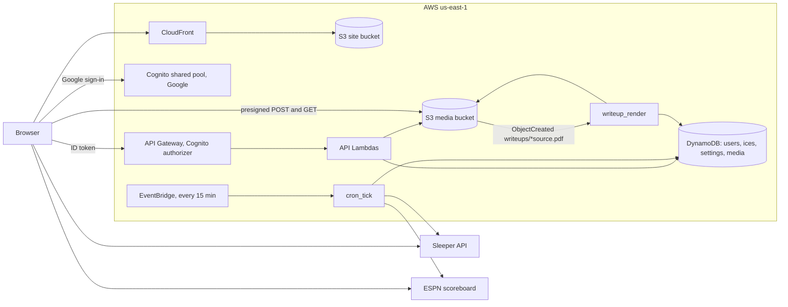
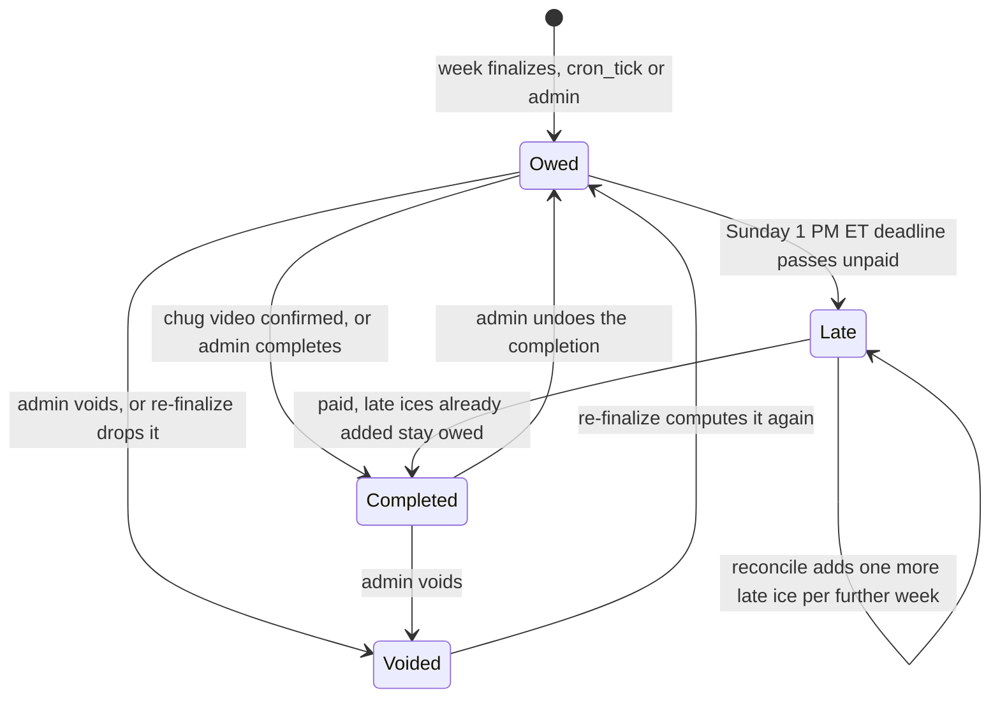

# Smirnoff League

The site for the Smirnoff League, a 14-team Sleeper fantasy football league. It shows
scores, standings, the playoff and toilet-bowl brackets, and the Smirnoff Ice ledger,
and it watches live games for ices. Everything past the landing page is behind Google
sign-in.

Live at https://smirnoff-league.com (`www` redirects there; the API is
`api.smirnoff-league.com`).

The repo is `domgiordano/smirnoff-league`. It moved from the `Xomware` org on
2026-09-23 and GitHub redirects the old URL. `main` is protected: every change goes
through a pull request, admins included.

- [`docs/architecture.md`](docs/architecture.md): how it fits together
- [`docs/runbook.md`](docs/runbook.md): deploys, admins, finalizing weeks, publishing editions, game days, failures, logs
- [`frontend/README.md`](frontend/README.md): a map of `frontend/lib/` and `frontend/components/`

## Features

- **Scores, standings, brackets:** live Sleeper data, including the toilet bowl.
- **Ice Watch:** live games scored against the ice rule as they happen.
- **Ice ledger:** every ice owed, completed, late or voided, snapshotted when a week finalizes.
- **Chug Board and Chug Reel:** Home's view of who owes, with countdowns, and a carousel of recent chug videos.
- **Due warning:** the signed-in manager's own debt and deadline, in the taskbar or phone title bar.
- **Chug videos:** one upload can settle several ices, across teams that chugged together.
- **News Drop:** weekly write-up PDFs, rendered to page images.
- **League News:** transactions, ledger events and editions in one feed.
- **Ice Stats and Ice Standings:** race, lineups, positions and per-team counts.
- **Notifications:** derived in the browser from the ledger, editions, videos and trades.
- **Control Panel:** admin-only ledger edits, week rules, finalize and toilet-bowl byes.

## System



Sources: `infrastructure/terraform/{web_hosting,api_gateway,lambda,dynamodb,s3_media,lambdas_cron,lambda_writeup_render}.tf`,
`frontend/lib/sleeper/client.ts`, `frontend/lib/espn.ts`.

## Ice lifecycle



"Late" is the original ice still owed past its deadline. Each late ice is its own
ledger row, `{parentIceId}#LATE{n}`, that is owed and completed like any other. The
rules are in `backend/lambdas/common/late.py` and `backend/lambdas/common/finalize.py`;
the full lifecycle is in [`docs/architecture.md`](docs/architecture.md#ledger-lifecycle).

## Layout

```
frontend/                   Next.js static export + Tailwind
backend/                    Python Lambdas and the shared layer code
infrastructure/terraform/   All AWS resources
fixtures/                   Golden ice fixture for both test suites
.github/workflows/          CI, Terraform, deploys
```

## Local development

Frontend:

```bash
cd frontend
npm install
node scripts/build-players.mjs   # once: writes public/data/players.json (build does this itself)
npm run dev                      # http://localhost:3000
npm test
npm run lint
npm run build                    # static export to frontend/out/
```

Sign-in and the API need `NEXT_PUBLIC_COGNITO_USER_POOL_ID`,
`NEXT_PUBLIC_COGNITO_CLIENT_ID`, `NEXT_PUBLIC_COGNITO_DOMAIN` and
`NEXT_PUBLIC_API_URL` in `frontend/.env.local`. The values are in SSM under
`/xomware/shared/cognito/` and `/smirnoff/api-url`. Without them the landing page
renders with sign-in disabled.

Backend (local tests need Python 3.11 or newer; CI uses 3.12):

```bash
cd backend
pip install pytest boto3 moto -r requirements.txt
python -m pytest -q
```

Terraform runs only in GitHub Actions. Do not run it locally.
