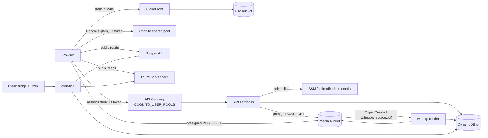

# Architecture

How the Smirnoff League site is put together. Where this doc and a plan under
`docs/features/` disagree, this doc follows the code; the plans are history.
Operational steps live in [`runbook.md`](runbook.md).

## System overview

| Piece | What it is | Defined in |
|---|---|---|
| Site | Next.js static export (`output: "export"`, `trailingSlash: true`), synced to an S3 bucket named after `var.domain_name` and served by CloudFront with a subroute rewrite | `frontend/next.config.ts`, `infrastructure/terraform/web_hosting.tf` (module `web-hosting` v1.4.0) |
| Auth | The shared Xomware Cognito pool, Google as the only identity provider. This stack creates no pool and no client; it reads the pool ARN from SSM `/xomware/shared/cognito/user-pool-arn` | `infrastructure/terraform/data_cognito.tf`, `frontend/lib/auth/amplify.ts` |
| API | API Gateway (module `api-gateway-service` v2.8.0) at `api.<domain_name>`, one Python Lambda per endpoint, every route on the native `COGNITO_USER_POOLS` authorizer | `infrastructure/terraform/api_gateway.tf`, `lambda.tf`, `acm.tf`, `route53.tf` |
| Shared code | One Lambda layer, `smirnoff-shared-packages`: `backend/lambdas/common/` plus `backend/requirements.txt` | `infrastructure/terraform/lambda_layers.tf`, `.github/workflows/deploy-backend.yml` |
| Tables | DynamoDB `smirnoff-users`, `smirnoff-ices`, `smirnoff-settings`, `smirnoff-media`. On-demand, CMK-encrypted, PITR on, deletion protection on, no GSIs | `infrastructure/terraform/dynamodb.tf`, `kms.tf` |
| Media bucket | Private `smirnoff-media-<account id>`, SSE-KMS, public access blocked. `videos/` holds chug videos, `writeups/` holds write-up PDFs and their rendered page WebPs | `infrastructure/terraform/s3_media.tf` |
| Cron | EventBridge rule, `rate(15 minutes)`, invoking `smirnoff-cron-tick` | `infrastructure/terraform/lambdas_cron.tf`, `backend/lambdas/cron_tick/handler.py` |
| Write-up renderer | `smirnoff-writeup-render`, invoked by S3 `ObjectCreated` on `writeups/*source.pdf`; rasterizes pages with pypdfium2 and Pillow | `infrastructure/terraform/lambda_writeup_render.tf`, `backend/lambdas/writeup_render/handler.py` |
| Config | SSM `/smirnoff/admin-emails` (StringList) and `/smirnoff/api-url` | `infrastructure/terraform/ssm.tf` |
| Sleeper | Public API, no auth. The browser reads scores, rosters, matchups, brackets and transactions directly; the backend reads `/state/nfl` and matchups for finalization. The build trims `/players/nfl` into `public/data/players.json` | `frontend/lib/sleeper/client.ts`, `backend/lambdas/common/sleeper.py`, `frontend/scripts/build-players.mjs` |
| ESPN | Public NFL scoreboard, no auth. The browser reads it for game clocks (Ice Watch); the backend reads it to decide a week is final and to find its last kickoff | `frontend/lib/espn.ts`, `backend/lambdas/common/espn.py` |

Region is `us-east-1` (`variables.tf`). Terraform state is in S3 bucket
`xomware-terraform-state`, key `smirnoff/terraform.tfstate` (`main.tf`).

### API surface

Every route is `COGNITO_USER_POOLS`. The module supports two path levels, so ids
travel in the body or query string (`lambda.tf`).

| Route | Lambda folder | Who |
|---|---|---|
| `GET /users/me` | `users_me` | signed in; returns profile and `isAdmin` |
| `POST /users/update` | `users_update` | signed in |
| `GET /ledger/get` | `ledger_get` | signed in |
| `POST /videos/presign`, `POST /videos/confirm`, `GET /videos/list` | `videos_*` | signed in; presign requires the caller's roster to own the ice, confirm requires the uploader; admins pass both |
| `GET /writeups/list` | `writeups_list` | signed in |
| `POST /admin/finalize`, `/admin/ice-adjust`, `/admin/ice-complete`, `/admin/chug-time`, `/admin/settings`, `/admin/writeup-presign`, `/admin/writeup-publish` | `admin_*` | admins (`require_admin`) |

Responses use a `{ data, error, meta }` envelope (`backend/lambdas/common/api.py`).

### Tables

| Table | Key | Holds | Access code |
|---|---|---|---|
| `smirnoff-users` | `sub` | name, username, rosterId, createdAt, updatedAt | `common/users_dynamo.py` |
| `smirnoff-ices` | `season` (`"2026"`), `iceId` | one row per ice: reason, status, completedAt, source, chugSeconds, videoId, parentIceId, note, updatedBy | `common/ices_dynamo.py` |
| `smirnoff-settings` | `season`, `key` (`WEEK#01`..`WEEK#17`, `TOILET_BRACKET`) | per-week `iceRulesActive`, `lowestScope`, `finalizedAt`, `deadlineUtc`; toilet bowl `byes` | `common/ices_dynamo.py`, `ledger_get/handler.py` |
| `smirnoff-media` | `kind` (`video`/`writeup`), `mediaId` (`W{ww}#{uuid}`) | video: iceId, rosterId, uploaderSub, s3Key, bytes, status. write-up: week, title, pdfKey, pageKeys, status, publishedAt | `common/media_dynamo.py` |

The season is hard-coded as `SEASON = "2026"` in `common/ices_dynamo.py`.

## Request flow

The browser sends the Cognito **ID token** (not the access token) because only
the ID token carries `email`, which the admin check needs
(`frontend/lib/api/users.ts`, `backend/lambdas/common/api.py` `caller_email`).

## The ice rule

One function, two implementations:

- Python, authoritative for the ledger: `backend/lambdas/common/ices.py` `week_ices`.
- TypeScript, for the client-side tally, drill-down views, stats and live previews:
  `frontend/lib/ices/compute.ts` `weekIces`.

Both suites run against `fixtures/ices-golden.json` (`backend/tests/test_ices.py`,
`frontend/lib/ices/compute.test.ts`). The fixture holds real W1/W2 Sleeper matchups
keyed by `roster_id` and player id, with expected ices hand-verified rather than
derived from the rule. `backend/scripts/build_ices_fixture.py` regenerates it.

The rule, as coded:

- Slots are `QB, RB, RB, WR, WR, TE, FLEX, FLEX, K, DEF`.
- If the week's `iceRulesActive` is false, no ices. Default: true for weeks 1-14.
- Each starter slot that is `"0"` or missing is an `empty` ice; each starter with
  points `<= 0` is a `zero` ice.
- Every roster at the minimum of `round(points, 2)` gets a `lowest` ice, so ties
  all owe. `lowestScope: "played"` limits the pool to rosters with a non-null
  `matchup_id`. Rounding is half-up in both languages; Python's `round()` is
  avoided on purpose.
- A roster Sleeper returns with `starters: null` owes nothing and is left out of
  the lowest pool (issue #45).
- Ids: `W{ww}#R{rr}#S{i}` and `W{ww}#R{rr}#LOWEST`.

While a week is live the client shows only `empty` ices as locked
(`lockedIces` in `compute.ts`), because a 0.0 may be a player yet to kick off.

## Ledger lifecycle

Ices are snapshotted when a week finalizes and nothing recomputes them on its own,
so Sleeper stat corrections are ignored. Only an admin re-finalize or a hand edit
changes them.

1. **Finalize.** `cron_tick` walks weeks 1 through `min(Sleeper current week, 17)`
   and finalizes every unfinalized week whose ESPN events are all completed
   (`cron_tick/handler.py`). `finalize_week` (`common/finalize.py`) computes ices
   and writes each with a conditional put, so a second finalize writes nothing, then
   sets `finalizedAt` on `WEEK#ww`. Rows start `owed` with `source: "cron"`.
2. **Re-finalize.** `POST /admin/finalize` with `refinalize: true` recomputes from
   Sleeper as of now. Computed rows the new result drops are voided; rows it keeps
   keep their status (a voided one returns to `owed`). Admin and late rows are never
   touched. Week-setting changes only take effect through a re-finalize once a week
   is finalized (`admin_settings/handler.py`).
3. **Late reconcile.** Every scheduled tick then runs `late.reconcile`
   (`common/late.py`):
   - A week's deadline is the first Sunday 13:00 America/New_York strictly after
     its last ESPN kickoff, stored once as `deadlineUtc`.
   - Each computed ice (`zero`, `empty`, `lowest`) unpaid at the deadline accrues
     one late ice, plus one more per further week, stepped in wall-clock weeks so
     DST does not shift it.
   - Late ices are rows `{parentIceId}#LATE{n}`. Reconcile creates missing ones,
     revives voided ones still due, and voids owed extras (for example after an
     admin backdates the parent's completion). A completed late row is never
     touched. Late ices do not accrue late ices, and admin ices never accrue.
   - `PAID_BEFORE_LAUNCH = (1, 2)`: owed ices in weeks 1 and 2 are marked completed
     at their deadline, so they never go late. Those weeks were chugged before the
     site existed.
4. **Completion.** Two paths:
   - **Upload.** `POST /videos/presign` returns a presigned POST (15 min, 1 byte
     to 200 MB, `video/*`) and writes a `pending` media row. The browser uploads to
     S3, then `POST /videos/confirm` HEADs the object, marks the media `ready`, and
     sets an `owed` ice to `completed` with `source: "upload"`. An already completed
     ice only gains the `videoId`.
   - **Admin.** `POST /admin/ice-complete` marks completed (optionally backdated
     with `at`) or undoes it; `/admin/ice-adjust` adds an `admin` ice or voids any
     ice; `/admin/chug-time` sets `chugSeconds`. All go through
     `common/ice_admin.py`, which stamps `updatedBy` and `updatedAt`. The same module
     backs `backend/scripts/ice_admin.py`.

Late rows catch up with any admin change on the next tick, within 15 minutes.

`GET /ledger/get` returns every non-voided ice, the week rows, the toilet bowl byes
(default `[13, 14]`) and a per-roster summary of owed, completed, overdue, late and
late-owed counts.

## Frontend structure

- **One real page.** `app/page.tsx` renders `AppShell`. The old routes
  (`/scores`, `/standings`, `/brackets`, `/ices`, `/stats`) are client redirects to
  `/?open=<kind>` (`components/desktop/OpenRedirect.tsx`). `app/auth/callback`
  completes sign-in.
- **Gate.** `app/layout.tsx` wraps everything in `DesktopProvider` then `AuthGate`.
  Signed out, `AuthGate` renders the landing (also while auth settles). Signed in,
  it adds `ProfileProvider`, `AlertsProvider` and `ProfileGate`, which holds the app
  until `/users/me` returns a profile and hosts the onboarding wizard.
- **Two shells.** `components/phone/AppShell.tsx` picks by media query
  `(max-width: 767.98px)` (`lib/use-media-query.ts`):
  - **Desktop:** an XP-style window manager. State is a reducer
    (`lib/desktop/windows.ts`) of windows with position, size, z-order, minimize,
    maximize and per-window back/forward history, held in context
    (`lib/desktop/desktop-context.tsx`). `components/desktop/Desktop.tsx` restores
    the layout from `localStorage` per user (`lib/desktop/persist.ts`, key
    `smirnoff.desktop.v1:`), applies `?open=` deep links
    (`lib/desktop/deep-link.ts`), and keeps the URL in sync.
  - **Phone:** `components/phone/PhoneShell.tsx` with bottom tabs `home`, `scores`,
    `ices`, `standings`, `my-team`. Each tab keeps a stack of screens
    (`lib/phone/nav.ts`), mirrored into browser history so hardware and swipe Back
    pop a screen (`lib/phone/use-phone-nav.ts`).
- **Registry.** `lib/desktop/registry.tsx` maps each window kind to its title,
  icon, component and default size. Both shells render bodies from it, so a new
  view is one registry entry.
- **Drill-down.** `components/views/drill-link.tsx` defines `DrillLink` and two
  contexts. `DrillContext` opens a new window (desktop) or pushes a screen (phone);
  `NavigateContext`, set by the containing window, navigates in place. Ctrl/Cmd-click
  and middle-click open a new window. Team, player and week data for those views is
  derived in `lib/league/drill.ts`.
- **Shared league cache.** `lib/league/cache.ts` keeps one promise per Sleeper or
  ESPN endpoint for the session, so every window shares fetches. Finished weeks never
  expire; the live week's matchups and transactions expire after 30 s, `nfl/state`
  and scoreboards after 5 min. A rejected promise is dropped so the next caller
  retries.
- **Ledger state.** `lib/ices/use-ledger.ts` fetches `/ledger/get`;
  `refreshLedger()` makes every mounted ledger view refetch after an admin edit or
  upload.
- **Ice Watch.** `lib/ices/use-ice-watch.ts` polls Sleeper and ESPN every 45 s while
  a game is in progress, otherwise sleeps until the next kickoff.

## Auth and security

- **The client gate is UX, not security.** The bundle is public; `AuthGate` only
  decides what a signed-out visitor sees (`components/auth/auth-gate.tsx`).
- **Public data stays public.** Sleeper, ESPN and `players.json` are public, and the
  browser reads them directly.
- **Private data is API-only.** Ledger, video and write-up data comes only from API
  routes behind the `COGNITO_USER_POOLS` authorizer. The module default authorizer is
  overridden to Cognito so no route inherits something weaker (`api_gateway.tf`).
  Handlers read claims the authorizer already verified and never parse raw tokens
  (`common/api.py`).
- **Media by presigned URL only.** The media bucket blocks public access. Uploads use
  presigned POSTs whose policy enforces `content-length-range`; reads use 1-hour
  presigned GETs from `/videos/list` and `/writeups/list`. The S3 client signs with
  SigV4 because S3 rejects SigV2 for SSE-KMS objects (`common/media_dynamo.py`).
- **Admins.** `require_admin` reads SSM `/smirnoff/admin-emails` on every call, no
  cache, and compares against the caller's lowercased `email` claim
  (`common/admins.py`). Terraform writes that parameter from `var.admin_emails`,
  which the Terraform workflow fills from the `ADMIN_EMAILS` repo secret
  (`ssm.tf`, `.github/workflows/terraform.yml`). `isAdmin` from `/users/me` only
  shows or hides admin UI; every admin route re-checks server-side.
- **CI identity.** GitHub OIDC only. The deploy role `smirnoff-github-actions-deploy`
  is owned by this stack and only `main` can assume it (`oidc_deploy.tf`). The
  Terraform plan and apply roles come from the `AWS_TERRAFORM_PLAN_ROLE_ARN` and
  `AWS_TERRAFORM_APPLY_ROLE_ARN` secrets; a pull request can only assume the plan role.
- **CORS.** The API and the media bucket allow `https://<domain_name>` and
  `http://localhost:3000` (`locals.tf`, `s3_media.tf`).
- **Public repo.** No manager names, emails, videos or PDFs in git. `.gitignore`
  excludes `*.pdf`, `*.mp4`, `*.mov` and `.env*`.

## File index

| Path | What |
|---|---|
| `frontend/app/layout.tsx` | Root providers and the auth gate |
| `frontend/components/phone/AppShell.tsx` | Desktop vs phone switch |
| `frontend/components/desktop/` | Desktop, window chrome, legacy-route redirect |
| `frontend/components/phone/` | Phone shell, start sheet |
| `frontend/components/windows/`, `frontend/components/views/` | Window and view bodies |
| `frontend/components/admin/` | Control Panel (ices, week rules and finalize, toilet bowl) |
| `frontend/lib/desktop/` | Window reducer, registry, deep links, layout persistence |
| `frontend/lib/phone/` | Phone tab stacks and history sync |
| `frontend/lib/league/` | League cache, standings, brackets, drill-down data |
| `frontend/lib/ices/` | Ice rule (TS), tally, stats, ledger and watch hooks |
| `frontend/lib/api/` | Authorized API client and per-route wrappers |
| `frontend/lib/auth/` | Amplify config and auth hook |
| `frontend/scripts/` | `build-players.mjs` (prebuild), `verify-build.mjs` (postbuild) |
| `backend/lambdas/<name>/handler.py` | One Lambda per folder; `smirnoff-<name with dashes>` |
| `backend/lambdas/common/` | Layer code: API plumbing, ice rule, finalize, late, admin, DynamoDB access |
| `backend/scripts/ice_admin.py` | Ledger admin CLI |
| `backend/scripts/build_ices_fixture.py` | Regenerates the golden fixture |
| `fixtures/ices-golden.json` | Golden ices shared by both test suites |
| `infrastructure/terraform/` | All AWS resources for this app |
| `.github/workflows/` | CI, Terraform, deploys, wait-for-terraform |

## Staleness

Recheck a section when a file matching its globs changes.

| Section | Globs |
|---|---|
| System overview, tables | `infrastructure/terraform/*.tf`, `backend/lambdas/common/sleeper.py`, `backend/lambdas/common/espn.py`, `frontend/lib/sleeper/**`, `frontend/lib/espn.ts` |
| API surface | `infrastructure/terraform/lambda.tf`, `infrastructure/terraform/api_gateway.tf`, `backend/lambdas/*/handler.py` |
| Request flow | `infrastructure/terraform/*.tf`, `frontend/lib/api/**`, `backend/lambdas/common/api.py` |
| The ice rule | `backend/lambdas/common/ices.py`, `frontend/lib/ices/compute.ts`, `fixtures/ices-golden.json` |
| Ledger lifecycle | `backend/lambdas/common/{finalize,late,ice_admin,ices_dynamo}.py`, `backend/lambdas/cron_tick/**`, `backend/lambdas/videos_*/**`, `backend/lambdas/admin_*/**`, `backend/lambdas/ledger_get/**` |
| Frontend structure | `frontend/app/**`, `frontend/components/{desktop,phone,auth,onboarding}/**`, `frontend/components/views/drill-link.tsx`, `frontend/lib/{desktop,phone,league}/**`, `frontend/lib/ices/use-*.ts` |
| Auth and security | `backend/lambdas/common/{api,admins,media_dynamo}.py`, `infrastructure/terraform/{api_gateway,ssm,s3_media,oidc_deploy,locals}.tf`, `frontend/lib/auth/**`, `frontend/components/auth/**`, `.github/workflows/terraform.yml` |
| File index | any new top-level folder under `frontend/`, `backend/` or `infrastructure/` |
