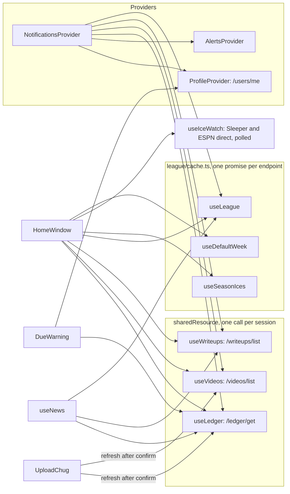

# Frontend

Next.js static export with Tailwind, in an XP-era Windows look. Commands and env
vars are in the [root README](../README.md); how it fits together is in
[`docs/architecture.md`](../docs/architecture.md#frontend-structure).

`app/page.tsx` is the one real page. The other routes under `app/` redirect to
`/?open=<kind>`, and `app/auth/callback` completes sign-in.

## `lib/`

| Path | What |
|---|---|
| `api/` | Authorized API client (Cognito ID token), one wrapper per route, and `upload.ts` for presigned POSTs with progress |
| `auth/` | Amplify config, `useAuth`, post-sign-in redirect path |
| `profile/use-profile.tsx` | `ProfileProvider`: `/users/me` (profile and `isAdmin`), `myRosterId`, profile editing, marking notifications seen |
| `alerts/alerts.tsx` | `AlertsProvider`: XP balloons and dialogs |
| `sleeper/`, `espn.ts` | Public Sleeper and ESPN clients and types |
| `league/cache.ts` | One promise per Sleeper or ESPN endpoint per session; the live week expires after 30 s, `nfl/state` and scoreboards after 5 min |
| `league/use-league.ts` | `useLeague`: league, users, rosters, `nfl/state` and players, plus matchups for a week, polled while live |
| `league/` (rest) | Default week, standings, brackets, drill-down data, manager profiles, the landing's overview |
| `shared-resource.ts` | `sharedResource`: one API request per session shared by every hook instance, with `refresh()` and an optional max age |
| `ices/use-ledger.ts` | `useLedger` and `refreshLedger`, on a shared resource |
| `videos/use-videos.ts` | `useVideos`, `refreshVideos`, `videoFor`; shared, 50-minute max age |
| `writeups/use-writeups.ts` | `useWriteups`, `refreshWriteups`; shared, 50-minute max age |
| `ices/` (rest) | The ice rule (`compute.ts`), season tally, Ice Watch states and polling, standings, stats, Chug Board data (`chug-board.ts`), the countdown clock (`use-now.ts`) |
| `notifications/` | `derive.ts` builds items; `NotificationsProvider` tracks unread and the balloon |
| `news/` | League News feed and `useNews` |
| `desktop/` | Window reducer, `REGISTRY` of window kinds, Ices folder apps, deep links, layout persistence (`smirnoff.desktop.v2:`) |
| `phone/` | Phone tab stacks and browser-history sync |
| `sound/` | XP sounds and mute |
| `activity/` | Signed-in activity tracker (batched, flushed every 30 s and on hide) and the admin timeline's wording |
| `use-media-query.ts`, `use-reduced-motion.ts` | `PHONE` query and reduced-motion hook |
| `test/` | Mocks for Sleeper, ESPN, the ledger, audio and XHR |

## `components/`

| Path | What |
|---|---|
| `auth/` | `AuthGate` (UX only, not security; starts the activity tracker when signed in) and the sign-in callback |
| `onboarding/` | `ProfileGate` and the first-run wizard |
| `landing/` | Signed-out landing page |
| `AppShell.tsx` | Picks the desktop or the phone app |
| `mobile/` | The phone app: `MobileShell`, the four tabs (Home, Games, Ices, Menu) and the screens they push |
| `desktop/` | `Desktop`, window chrome, desktop icons, legacy-route redirect |
| `xp/` | XP widgets: window, dialog, taskbar, Start menu, balloon, icons, notification bell |
| `windows/` | Window bodies: Home, scores, standings, brackets, ledger, Ice Watch, videos, News Drop, news, notifications, Ices folder |
| `views/` | Views and parts shared across windows: team, player, week, stats, Ice Standings, charts, `DrillLink` |
| `home/` | Chug Board, Chug Reel, due warning |
| `videos/` | Chug upload dialog and player |
| `admin/` | Control Panel: ices, week rules and finalize, toilet bowl, users |

## Data hooks

`useIceWatch` calls Sleeper and ESPN directly (`lib/ices/use-ice-watch.ts`), so each
mounted watcher polls on its own. Everything else public goes through
`lib/league/cache.ts`.
